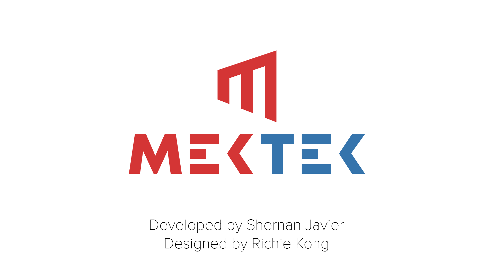
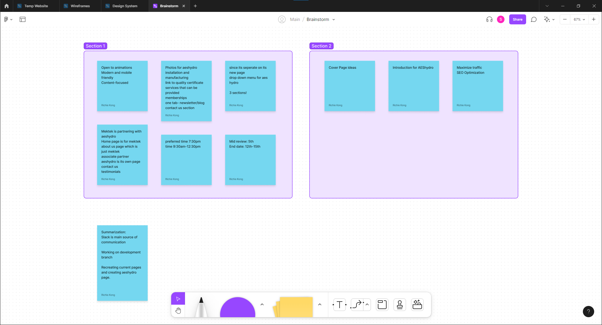
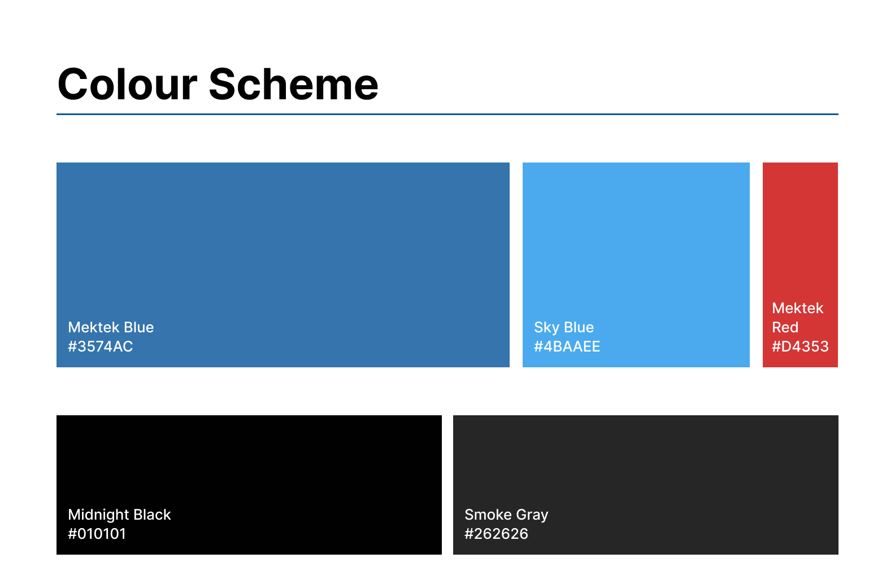
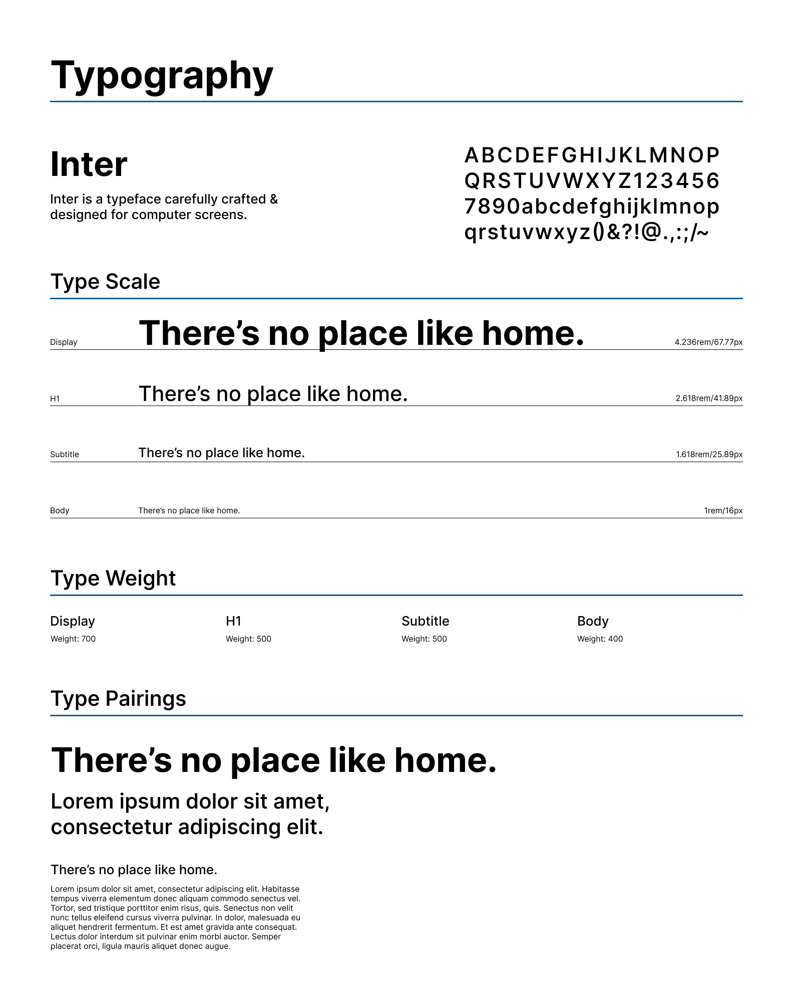
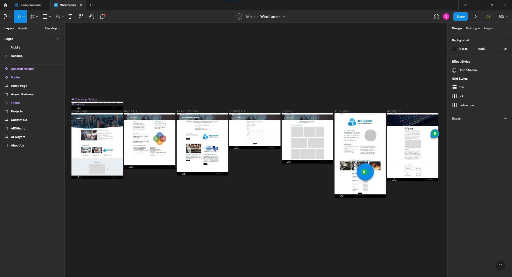
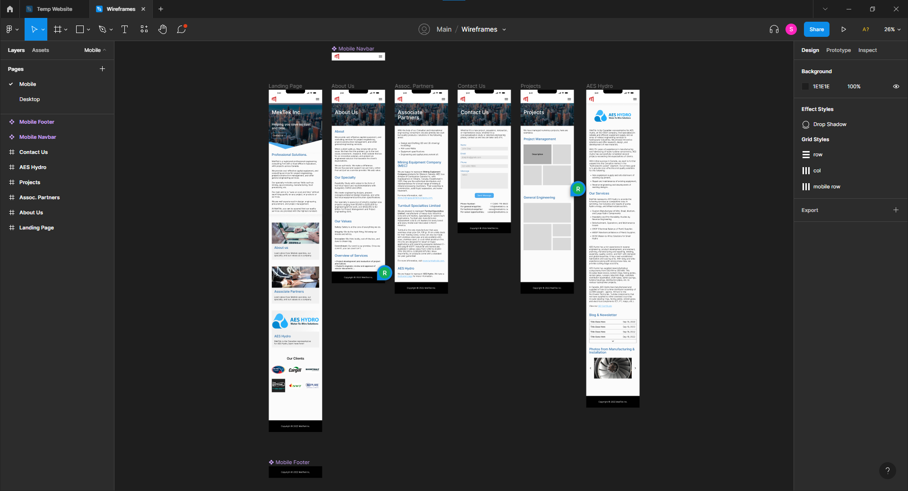
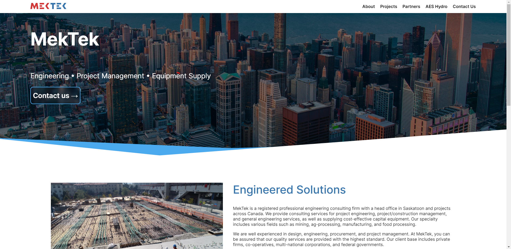

<h1 align="center">MekTek Theme</h1>

<a href="https://www.mektekinc.ca/">https://www.mektekinc.ca/</a>   Developed and Designed by <a href="https://www.shernanjavier.com/">Shernan Javier</a> & <a href="https://www.richiekong.design/">Richie Kong</a>

  

<h3 align="center">Ideas</h3>

<h3 align="center">Colour Scheme</h3>

<h3 align="center">Typography</h3>

<h3 align="center">Desktop Prototypes</h3>

<a href="https://www.figma.com/file/meh8jj06VBFfplzXBFErMh/Wireframes?node-id=1%3A8">View on Figma</a>
  

<h3 align="center">Mobile Prototypes</h3>

<a href="https://www.figma.com/file/meh8jj06VBFfplzXBFErMh/Wireframes?node-id=0%3A1">View on Figma</a>
  

<h2>Comparison</h2>

<h3 align="center">Old Landing Page</h3>

<h3 align="center">Updated Landing Page</h3>

   

<h2 align="center">Technologies</h2>

<table>
  <tr>
    <th>Code</th>
    <th>Design</th>
    <th>Deployed On</th>
  </tr>
  <tr> 
    <td></td>
    <td></td>
    <td></td>
  </tr>
  <tr>
    <td></td>
    <td></td>
    <td></td>
  </tr>
  <tr>
    <td></td>
    <td></td>
    <td></td>
  </tr>
  <tr>
    <td></td>
    <td></td>
    <td></td>
  </tr>
 </table>

